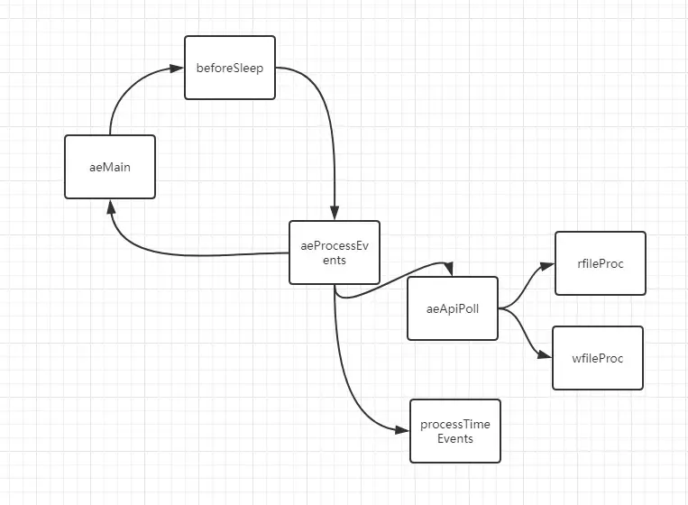

## Context
Redis's EventLoop includes two types of events:

1. FileEvent (more accurately translated as IO Event)
2. TimeEvent

All events are handled in the EventLoop, with an overall overview as follows: 

## Goal

1. Abstract EventLoop and AeMain into modules.
2. Use tokio-mio to simulate Redis and implement aeApiPoll for different platforms.

## Changes

